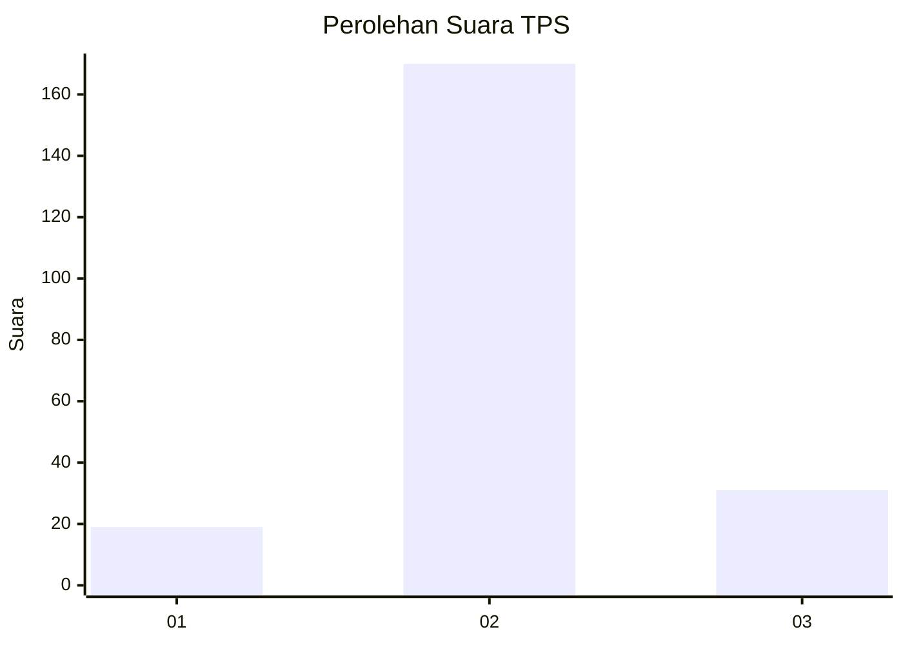

# Hasil

## Grafik

## Tabel

| No. | Nama Paslon    | Suara | Suara (raw) | Persentase |
|:--- |:-------------- | -----:| -----------:| ----------:|
| 1   | ANIES MUHAIMIN | 19    | [19][p-1]   | 8,64       |
| 2   | PRABOWO GIBRAN | 170   | [170][p-2]  | 77,27      |
| 3   | GANJAR MAHFUD  | 31    | [31][p-3]   | 14,09      |

[p-1]: https://github.com/gigit-pemilu/pemilu-2024-76-sulawesi-barat/blob/main/pilpres/hitung-suara/sub/76-sulawesi-barat/sub/01-pasangkayu/sub/01-bambalamotu/sub/2003-polewali/sub/004-tps/sub/paslon-1.txt
[p-2]: https://github.com/gigit-pemilu/pemilu-2024-76-sulawesi-barat/blob/main/pilpres/hitung-suara/sub/76-sulawesi-barat/sub/01-pasangkayu/sub/01-bambalamotu/sub/2003-polewali/sub/004-tps/sub/paslon-2.txt
[p-3]: https://github.com/gigit-pemilu/pemilu-2024-76-sulawesi-barat/blob/main/pilpres/hitung-suara/sub/76-sulawesi-barat/sub/01-pasangkayu/sub/01-bambalamotu/sub/2003-polewali/sub/004-tps/sub/paslon-3.txt

## Foto C Plano

https://sirekap-obj-formc.kpu.go.id/6df6/pemilu/ppwp/76/01/01/20/03/7601012003004-20240216-155050--5a29e208-cf0b-4d27-bd42-c2b59691fa70.jpg

https://sirekap-obj-formc.kpu.go.id/6df6/pemilu/ppwp/76/01/01/20/03/7601012003004-20240216-155052--bf21fd3f-f32a-4347-9db2-3938d65e82ee.jpg

https://sirekap-obj-formc.kpu.go.id/6df6/pemilu/ppwp/76/01/01/20/03/7601012003004-20240216-155051--f5fc960c-585e-4063-a4a8-f4fab2fa2e65.jpg

## Metadata

| Key        | Value               |
| ---------- | ------------------- |
| Time Stamp | 2024-02-16 23:00:00 |

## DATA PEMILIH TETAP

Jumlah pemilih dalam DPT: **270**.
 * L: **136**.
 * P: **134**.

## DATA PENGGUNA HAK PILIH

Jumlah pengguna hak pilih dalam DPT: **214**.
 * L: **104**.
 * P: **110**.

Jumlah pengguna hak pilih dalam DPTb: **3**.
 * L: **1**.
 * P: **2**.

Jumlah pengguna hak pilih dalam DPK: **4**.
 * L: **2**.
 * P: **2**.

Jumlah pengguna hak pilih: **221**.
 * L: **107**.
 * P: **114**.

## JUMLAH SUARA SAH DAN TIDAK SAH

JUMLAH SELURUH SUARA SAH: **220**.

JUMLAH SUARA TIDAK SAH: **1**.

JUMLAH SELURUH SUARA SAH DAN SUARA TIDAK SAH: **221**.

