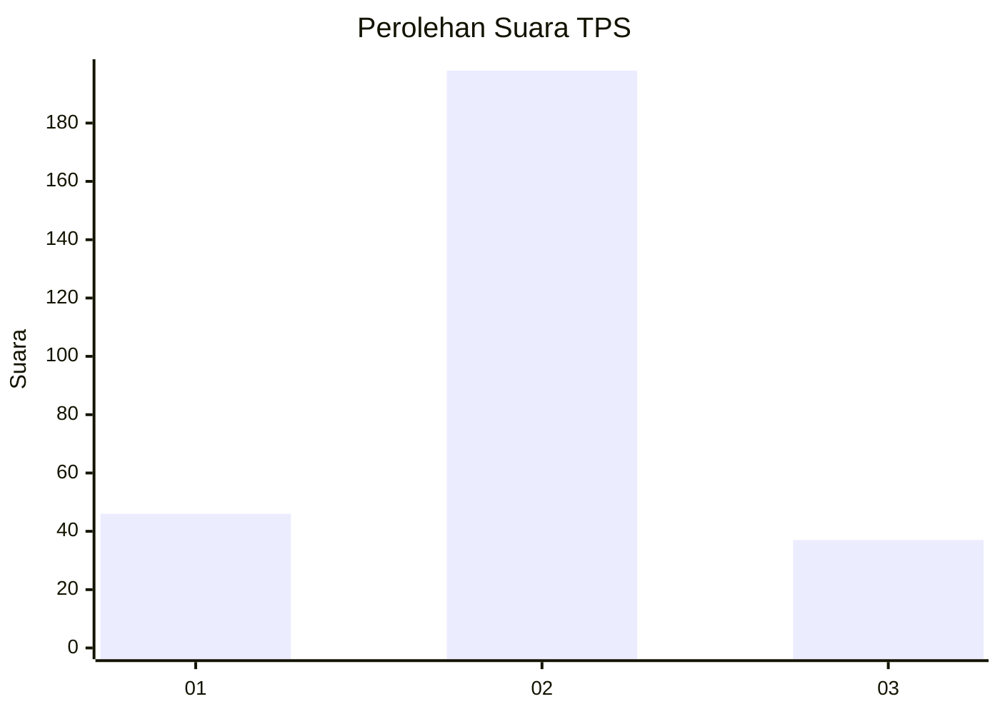
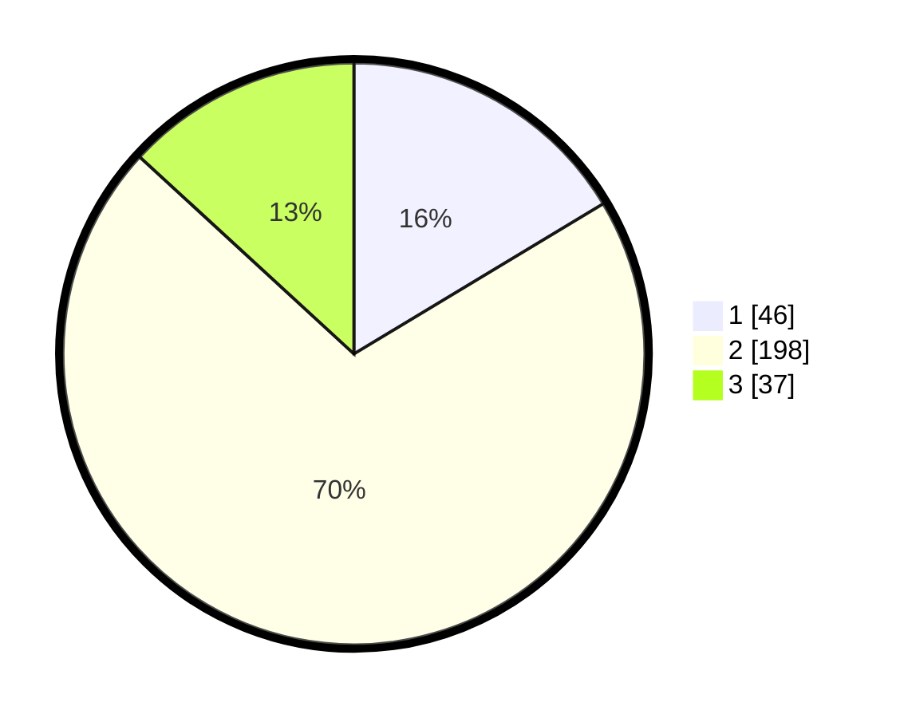

# Hasil

## Grafik

## Tabel

| No. | Nama Paslon    | Suara | Suara (raw) | Persentase |
|:--- |:-------------- | -----:| -----------:| ----------:|
| 1   | ANIES MUHAIMIN | 46    | [46][p-1]   | 16,37      |
| 2   | PRABOWO GIBRAN | 198   | [198][p-2]  | 70,46      |
| 3   | GANJAR MAHFUD  | 37    | [37][p-3]   | 13,17      |

[p-1]: https://github.com/gigit-pemilu/pemilu-2024-76-sulawesi-barat/blob/main/pilpres/hitung-suara/sub/76-sulawesi-barat/sub/01-pasangkayu/sub/01-bambalamotu/sub/2003-polewali/sub/005-tps/sub/paslon-1.txt
[p-2]: https://github.com/gigit-pemilu/pemilu-2024-76-sulawesi-barat/blob/main/pilpres/hitung-suara/sub/76-sulawesi-barat/sub/01-pasangkayu/sub/01-bambalamotu/sub/2003-polewali/sub/005-tps/sub/paslon-2.txt
[p-3]: https://github.com/gigit-pemilu/pemilu-2024-76-sulawesi-barat/blob/main/pilpres/hitung-suara/sub/76-sulawesi-barat/sub/01-pasangkayu/sub/01-bambalamotu/sub/2003-polewali/sub/005-tps/sub/paslon-3.txt

## Foto C Plano

https://sirekap-obj-formc.kpu.go.id/0365/pemilu/ppwp/76/01/01/20/03/7601012003005-20240216-143806--67de2547-75ac-4534-9ec9-78ebe6b30e3c.jpg

https://sirekap-obj-formc.kpu.go.id/0365/pemilu/ppwp/76/01/01/20/03/7601012003005-20240216-143807--1d2347bc-a086-4ff6-8841-ceae06c8d908.jpg

https://sirekap-obj-formc.kpu.go.id/0365/pemilu/ppwp/76/01/01/20/03/7601012003005-20240216-143807--b5d37a4c-9c59-4fca-9404-13665e2313bd.jpg

## Metadata

| Key        | Value               |
| ---------- | ------------------- |
| Time Stamp | 2024-02-16 23:00:00 |

## DATA PEMILIH TETAP

Jumlah pemilih dalam DPT: **295**.
 * L: **146**.
 * P: **149**.

## DATA PENGGUNA HAK PILIH

Jumlah pengguna hak pilih dalam DPT: **262**.
 * L: **127**.
 * P: **135**.

Jumlah pengguna hak pilih dalam DPTb: **13**.
 * L: **10**.
 * P: **3**.

Jumlah pengguna hak pilih dalam DPK: **10**.
 * L: **7**.
 * P: **3**.

Jumlah pengguna hak pilih: **285**.
 * L: **144**.
 * P: **141**.

## JUMLAH SUARA SAH DAN TIDAK SAH

JUMLAH SELURUH SUARA SAH: **281**.

JUMLAH SUARA TIDAK SAH: **4**.

JUMLAH SELURUH SUARA SAH DAN SUARA TIDAK SAH: **285**.

