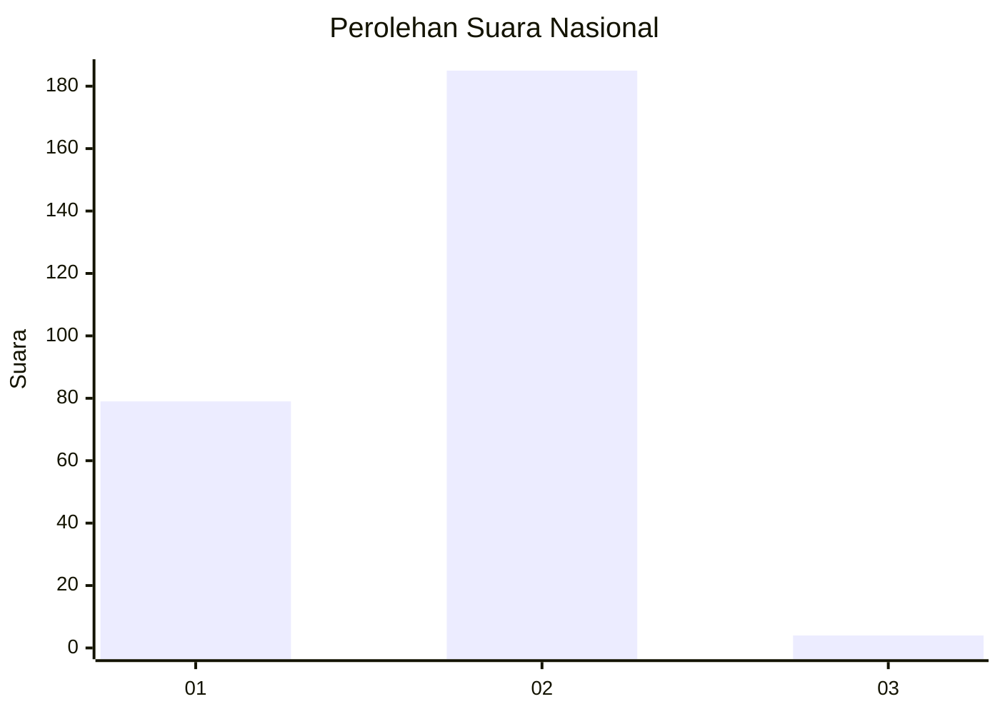
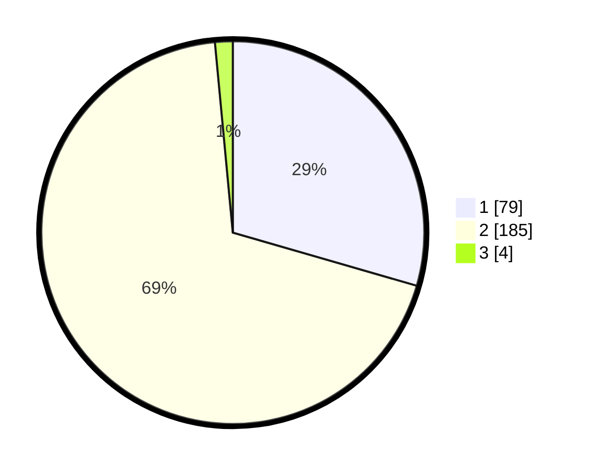

# Hasil

## Grafik

## Tabel

| No. | Nama Paslon    | Suara | Suara (raw) | Persentase |
|:--- |:-------------- | -----:| -----------:| ----------:|
| 1   | ANIES MUHAIMIN | 79    | [79][p-1]   | 29,48      |
| 2   | PRABOWO GIBRAN | 185   | [185][p-2]  | 69,03      |
| 3   | GANJAR MAHFUD  | 4     | [4][p-3]    | 1,49       |

[p-1]: https://github.com/gigit-pemilu/pemilu-2024/blob/main/pilpres/hitung-suara/sub/76-sulawesi-barat/sub/01-pasangkayu/sub/02-pasangkayu/sub/1001-pasangkayu/sub/010-tps/sub/paslon-1.txt
[p-2]: https://github.com/gigit-pemilu/pemilu-2024/blob/main/pilpres/hitung-suara/sub/76-sulawesi-barat/sub/01-pasangkayu/sub/02-pasangkayu/sub/1001-pasangkayu/sub/010-tps/sub/paslon-2.txt
[p-3]: https://github.com/gigit-pemilu/pemilu-2024/blob/main/pilpres/hitung-suara/sub/76-sulawesi-barat/sub/01-pasangkayu/sub/02-pasangkayu/sub/1001-pasangkayu/sub/010-tps/sub/paslon-3.txt

## Foto C Plano

https://sirekap-obj-formc.kpu.go.id/4729/pemilu/ppwp/76/01/02/10/01/7601021001010-20240218-145521--ace5f581-329c-4e77-bd12-d646785738bc.jpg

https://sirekap-obj-formc.kpu.go.id/4729/pemilu/ppwp/76/01/02/10/01/7601021001010-20240218-144855--88fdfcc9-caef-4e2b-9992-5a1bfebd8b41.jpg

https://sirekap-obj-formc.kpu.go.id/4729/pemilu/ppwp/76/01/02/10/01/7601021001010-20240218-145101--4fc30638-5e5f-472f-ae69-cefe82ad639a.jpg

## Metadata

| Key        | Value               |
| ---------- | ------------------- |
| Time Stamp | 2024-02-19 17:00:00 |

## DATA PEMILIH TETAP

Jumlah pemilih dalam DPT: **293**.
 * L: **742**.
 * P: **345**.

## DATA PENGGUNA HAK PILIH

Jumlah pengguna hak pilih dalam DPT: **283**.
 * L: **104**.
 * P: **222**.

Jumlah pengguna hak pilih dalam DPTb: **348**.
 * L: **364**.
 * P: **234**.

Jumlah pengguna hak pilih dalam DPK: **340**.
 * L: **655**.
 * P: **640**.

Jumlah pengguna hak pilih: **233**.
 * L: **413**.
 * P: **423**.

## JUMLAH SUARA SAH DAN TIDAK SAH

JUMLAH SELURUH SUARA SAH: **232**.

JUMLAH SUARA TIDAK SAH: **4**.

JUMLAH SELURUH SUARA SAH DAN SUARA TIDAK SAH: **236**.

