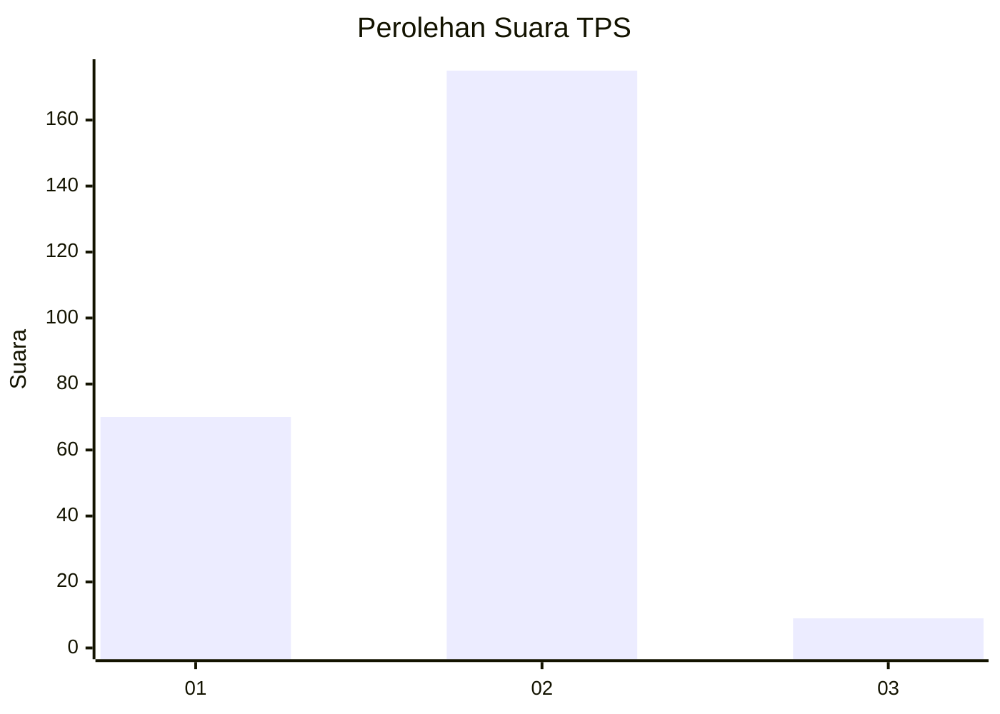
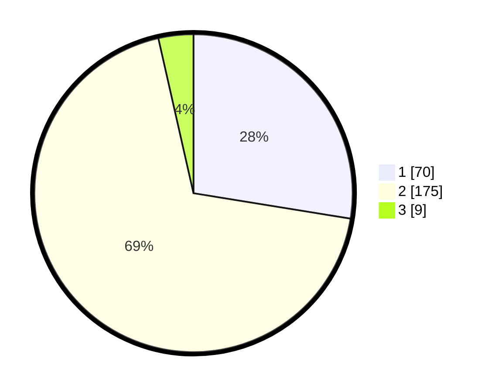

# Hasil

## Grafik

## Tabel

| No. | Nama Paslon    | Suara | Suara (raw) | Persentase |
|:--- |:-------------- | -----:| -----------:| ----------:|
| 1   | ANIES MUHAIMIN | 70    | [70][p-1]   | 27,56      |
| 2   | PRABOWO GIBRAN | 175   | [175][p-2]  | 68,90      |
| 3   | GANJAR MAHFUD  | 9     | [9][p-3]    | 3,54       |

[p-1]: https://github.com/gigit-pemilu/pemilu-2024-76-sulawesi-barat/blob/main/pilpres/hitung-suara/sub/76-sulawesi-barat/sub/01-pasangkayu/sub/04-sarudu/sub/2001-sarudu/sub/005-tps/sub/paslon-1.txt
[p-2]: https://github.com/gigit-pemilu/pemilu-2024-76-sulawesi-barat/blob/main/pilpres/hitung-suara/sub/76-sulawesi-barat/sub/01-pasangkayu/sub/04-sarudu/sub/2001-sarudu/sub/005-tps/sub/paslon-2.txt
[p-3]: https://github.com/gigit-pemilu/pemilu-2024-76-sulawesi-barat/blob/main/pilpres/hitung-suara/sub/76-sulawesi-barat/sub/01-pasangkayu/sub/04-sarudu/sub/2001-sarudu/sub/005-tps/sub/paslon-3.txt

## Foto C Plano

https://sirekap-obj-formc.kpu.go.id/cda7/pemilu/ppwp/76/01/04/20/01/7601042001005-20240215-071306--d5e5f59f-ca86-45d0-b3e5-83ae2dd8d144.jpg

https://sirekap-obj-formc.kpu.go.id/cda7/pemilu/ppwp/76/01/04/20/01/7601042001005-20240215-071702--0ed269f7-2fc3-403c-aa23-27cd4d576432.jpg

https://sirekap-obj-formc.kpu.go.id/cda7/pemilu/ppwp/76/01/04/20/01/7601042001005-20240215-072020--375f21fa-82ca-4878-8ada-ca19a386fd4c.jpg

## Metadata

| Key        | Value               |
| ---------- | ------------------- |
| Time Stamp | 2024-02-15 20:30:46 |

