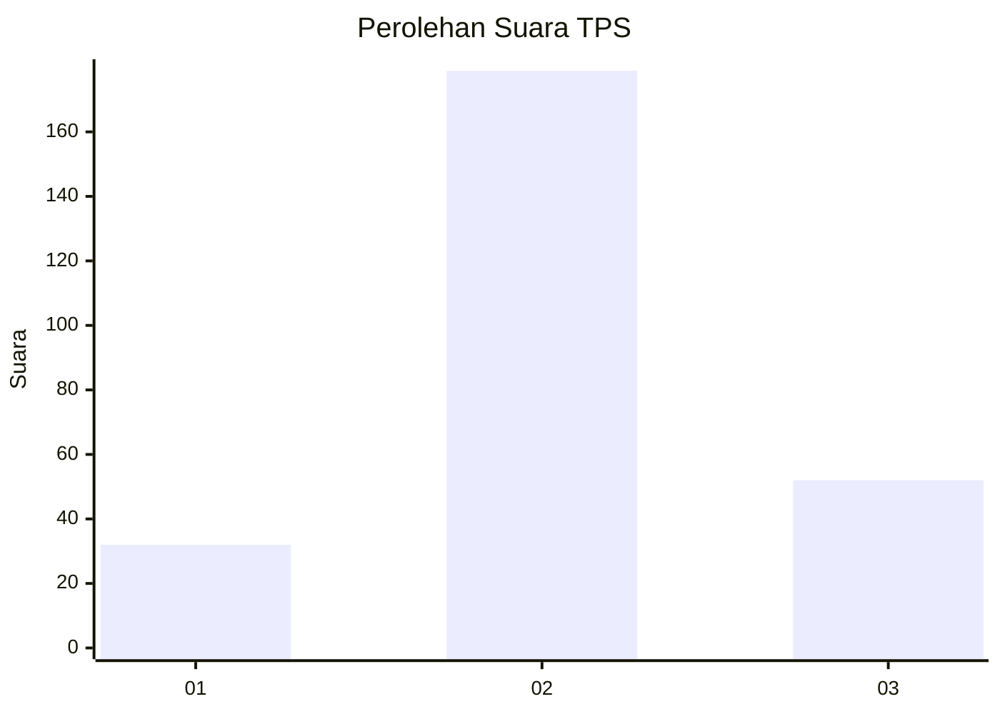
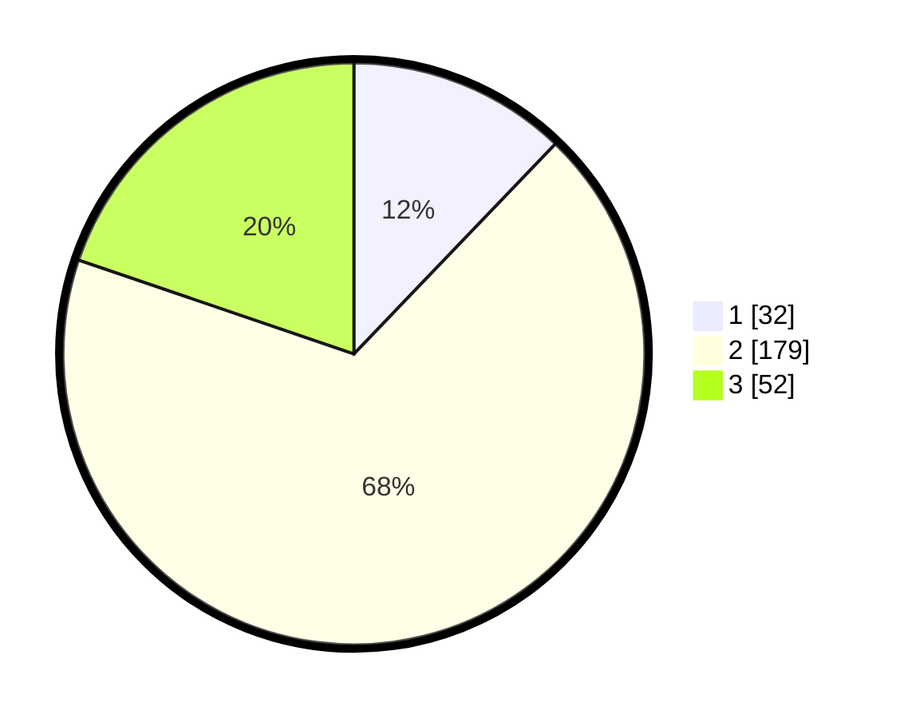

# Hasil

## Grafik

## Tabel

| No. | Nama Paslon    | Suara | Suara (raw) | Persentase |
|:--- |:-------------- | -----:| -----------:| ----------:|
| 1   | ANIES MUHAIMIN | 32    | [32][p-1]   | 12,17      |
| 2   | PRABOWO GIBRAN | 179   | [179][p-2]  | 68,06      |
| 3   | GANJAR MAHFUD  | 52    | [52][p-3]   | 19,77      |

[p-1]: https://github.com/gigit-pemilu/pemilu-2024-76-sulawesi-barat/blob/main/pilpres/hitung-suara/sub/76-sulawesi-barat/sub/01-pasangkayu/sub/08-tikke-raya/sub/2005-jengeng-raya/sub/006-tps/sub/paslon-1.txt
[p-2]: https://github.com/gigit-pemilu/pemilu-2024-76-sulawesi-barat/blob/main/pilpres/hitung-suara/sub/76-sulawesi-barat/sub/01-pasangkayu/sub/08-tikke-raya/sub/2005-jengeng-raya/sub/006-tps/sub/paslon-2.txt
[p-3]: https://github.com/gigit-pemilu/pemilu-2024-76-sulawesi-barat/blob/main/pilpres/hitung-suara/sub/76-sulawesi-barat/sub/01-pasangkayu/sub/08-tikke-raya/sub/2005-jengeng-raya/sub/006-tps/sub/paslon-3.txt

## Foto C Plano

https://sirekap-obj-formc.kpu.go.id/5379/pemilu/ppwp/76/01/08/20/05/7601082005006-20240217-155610--930293bb-2e47-42be-bd3a-ac27f4f0bfed.jpg

https://sirekap-obj-formc.kpu.go.id/5379/pemilu/ppwp/76/01/08/20/05/7601082005006-20240217-164345--8013923f-44e7-4f23-964b-48e77b88f7cf.jpg

https://sirekap-obj-formc.kpu.go.id/5379/pemilu/ppwp/76/01/08/20/05/7601082005006-20240217-165124--9b0ed470-bb10-4324-9309-01baca59fa69.jpg

## Metadata

| Key        | Value               |
| ---------- | ------------------- |
| Time Stamp | 2024-02-17 17:00:04 |

## DATA PEMILIH TETAP

Jumlah pemilih dalam DPT: **253**.
 * L: **633**.
 * P: **420**.

## DATA PENGGUNA HAK PILIH

Jumlah pengguna hak pilih dalam DPT: **204**.
 * L: **604**.
 * P: **400**.

Jumlah pengguna hak pilih dalam DPTb: **2**.
 * L: **6**.
 * P: **7**.

Jumlah pengguna hak pilih dalam DPK: **89**.
 * L: **63**.
 * P: **6**.

Jumlah pengguna hak pilih: **225**.
 * L: **828**.
 * P: **607**.

## JUMLAH SUARA SAH DAN TIDAK SAH

JUMLAH SELURUH SUARA SAH: **222**.

JUMLAH SUARA TIDAK SAH: **3**.

JUMLAH SELURUH SUARA SAH DAN SUARA TIDAK SAH: **225**.

