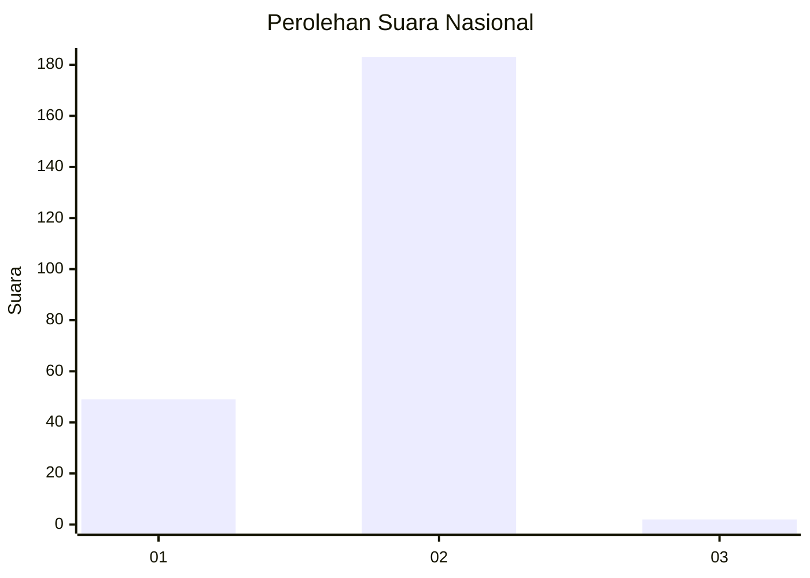
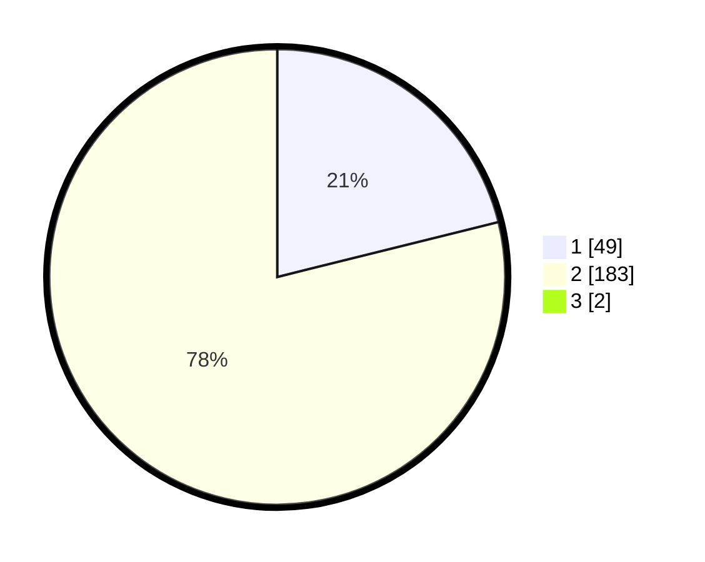

# Hasil

## Grafik

## Tabel

| No. | Nama Paslon    | Suara | Suara (raw) | Persentase |
|:--- |:-------------- | -----:| -----------:| ----------:|
| 1   | ANIES MUHAIMIN | 49    | [49][p-1]   | 20,94      |
| 2   | PRABOWO GIBRAN | 183   | [183][p-2]  | 78,21      |
| 3   | GANJAR MAHFUD  | 2     | [2][p-3]    | 0,85       |

[p-1]: https://github.com/gigit-pemilu/pemilu-2024/blob/main/pilpres/hitung-suara/sub/76-sulawesi-barat/sub/01-pasangkayu/sub/10-bambaira/sub/2001-bambaira/sub/004-tps/sub/paslon-1.txt
[p-2]: https://github.com/gigit-pemilu/pemilu-2024/blob/main/pilpres/hitung-suara/sub/76-sulawesi-barat/sub/01-pasangkayu/sub/10-bambaira/sub/2001-bambaira/sub/004-tps/sub/paslon-2.txt
[p-3]: https://github.com/gigit-pemilu/pemilu-2024/blob/main/pilpres/hitung-suara/sub/76-sulawesi-barat/sub/01-pasangkayu/sub/10-bambaira/sub/2001-bambaira/sub/004-tps/sub/paslon-3.txt

## Foto C Plano

https://sirekap-obj-formc.kpu.go.id/0f7c/pemilu/ppwp/76/01/10/20/01/7601102001004-20240215-092528--e681dfad-595b-4793-b4af-867c07659569.jpg

https://sirekap-obj-formc.kpu.go.id/0f7c/pemilu/ppwp/76/01/10/20/01/7601102001004-20240215-092645--8573cec4-bf60-4e17-8189-60ed6f410b48.jpg

https://sirekap-obj-formc.kpu.go.id/0f7c/pemilu/ppwp/76/01/10/20/01/7601102001004-20240215-092721--59fa611b-6825-4d58-8160-4ff92f15bafb.jpg

## Metadata

| Key        | Value               |
| ---------- | ------------------- |
| Time Stamp | 2024-02-15 19:30:26 |

