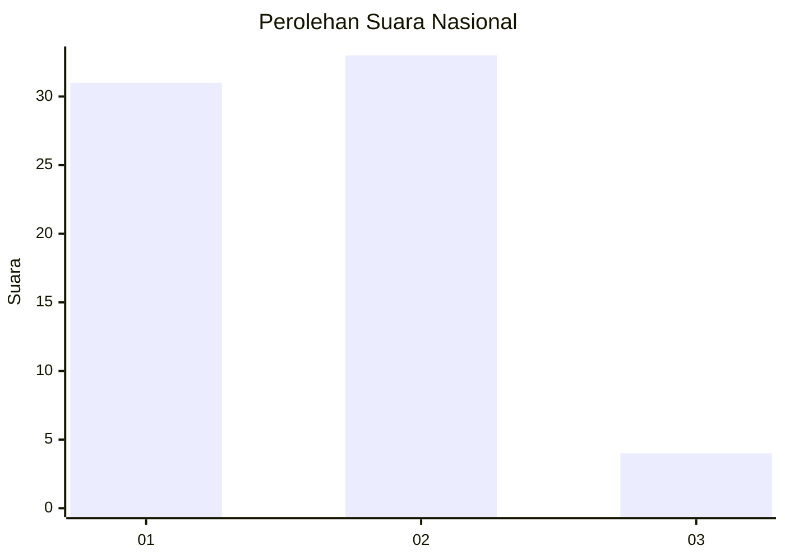
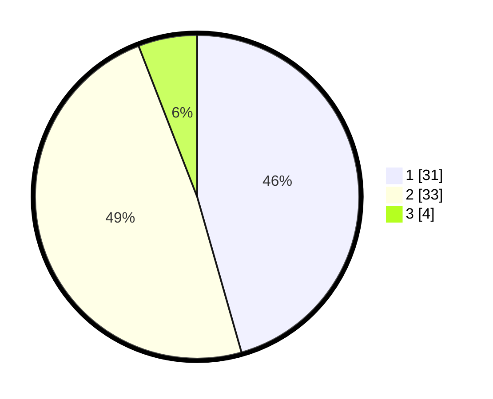

# Hasil

## Grafik

## Tabel

| No. | Nama Paslon    | Suara | Suara (raw) | Persentase |
|:--- |:-------------- | -----:| -----------:| ----------:|
| 1   | ANIES MUHAIMIN | 31    | [31][p-1]   | 45,59      |
| 2   | PRABOWO GIBRAN | 33    | [33][p-2]   | 48,53      |
| 3   | GANJAR MAHFUD  | 4     | [4][p-3]    | 5,88       |

[p-1]: https://github.com/gigit-pemilu/pemilu-2024/blob/main/pilpres/hitung-suara/sub/76-sulawesi-barat/sub/02-mamuju/sub/04-kalumpang/sub/2001-kalumpang/sub/003-tps/sub/paslon-1.txt
[p-2]: https://github.com/gigit-pemilu/pemilu-2024/blob/main/pilpres/hitung-suara/sub/76-sulawesi-barat/sub/02-mamuju/sub/04-kalumpang/sub/2001-kalumpang/sub/003-tps/sub/paslon-2.txt
[p-3]: https://github.com/gigit-pemilu/pemilu-2024/blob/main/pilpres/hitung-suara/sub/76-sulawesi-barat/sub/02-mamuju/sub/04-kalumpang/sub/2001-kalumpang/sub/003-tps/sub/paslon-3.txt

## Foto C Plano

https://sirekap-obj-formc.kpu.go.id/fbb9/pemilu/ppwp/76/02/04/20/01/7602042001003-20240218-132028--c29d3f2b-8b21-4e48-b300-33bd9f1b429c.jpg

https://sirekap-obj-formc.kpu.go.id/fbb9/pemilu/ppwp/76/02/04/20/01/7602042001003-20240218-132030--acef1726-3426-4b4c-8df0-f9aef780ab73.jpg

https://sirekap-obj-formc.kpu.go.id/fbb9/pemilu/ppwp/76/02/04/20/01/7602042001003-20240218-132029--bd79e996-d4db-4047-bf31-71a4e6ba15bb.jpg

## Metadata

| Key        | Value               |
| ---------- | ------------------- |
| Time Stamp | 2024-02-20 20:00:00 |

## DATA PEMILIH TETAP

Jumlah pemilih dalam DPT: **131**.
 * L: **71**.
 * P: **60**.

## DATA PENGGUNA HAK PILIH

Jumlah pengguna hak pilih dalam DPT: **49**.
 * L: **25**.
 * P: **24**.

Jumlah pengguna hak pilih dalam DPTb: **19**.
 * L: **15**.
 * P: **4**.

Jumlah pengguna hak pilih dalam DPK: **1**.
 * L: **0**.
 * P: **1**.

Jumlah pengguna hak pilih: **69**.
 * L: **40**.
 * P: **29**.

## JUMLAH SUARA SAH DAN TIDAK SAH

JUMLAH SELURUH SUARA SAH: **68**.

JUMLAH SUARA TIDAK SAH: **1**.

JUMLAH SELURUH SUARA SAH DAN SUARA TIDAK SAH: **69**.

