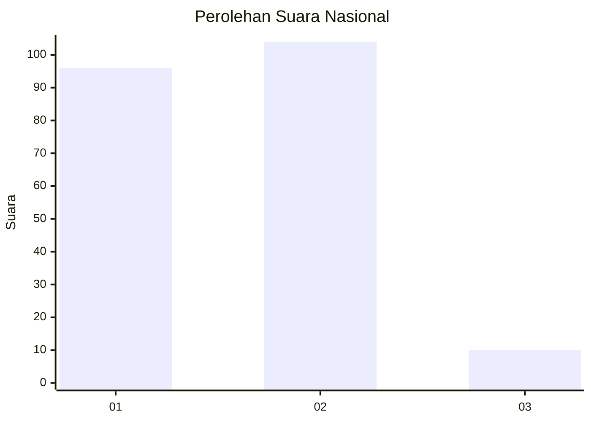
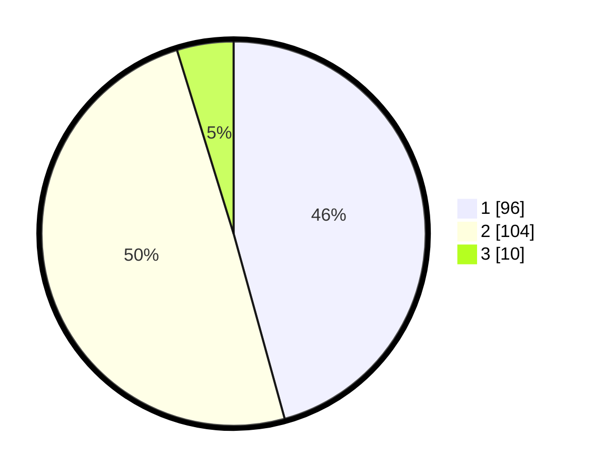

# Hasil

## Grafik

## Tabel

| No. | Nama Paslon    | Suara | Suara (raw) | Persentase |
|:--- |:-------------- | -----:| -----------:| ----------:|
| 1   | ANIES MUHAIMIN | 96    | [96][p-1]   | 45,71      |
| 2   | PRABOWO GIBRAN | 104   | [104][p-2]  | 49,52      |
| 3   | GANJAR MAHFUD  | 10    | [10][p-3]   | 4,76       |

[p-1]: https://github.com/gigit-pemilu/pemilu-2024/blob/main/pilpres/hitung-suara/sub/76-sulawesi-barat/sub/02-mamuju/sub/12-simboro/sub/1001-simboro/sub/007-tps/sub/paslon-1.txt
[p-2]: https://github.com/gigit-pemilu/pemilu-2024/blob/main/pilpres/hitung-suara/sub/76-sulawesi-barat/sub/02-mamuju/sub/12-simboro/sub/1001-simboro/sub/007-tps/sub/paslon-2.txt
[p-3]: https://github.com/gigit-pemilu/pemilu-2024/blob/main/pilpres/hitung-suara/sub/76-sulawesi-barat/sub/02-mamuju/sub/12-simboro/sub/1001-simboro/sub/007-tps/sub/paslon-3.txt

## Foto C Plano

https://sirekap-obj-formc.kpu.go.id/fc17/pemilu/ppwp/76/02/12/10/01/7602121001007-20240215-102817--7269237f-8830-4dc2-904d-c08c830f00ea.jpg

https://sirekap-obj-formc.kpu.go.id/fc17/pemilu/ppwp/76/02/12/10/01/7602121001007-20240215-215543--f326a978-bc45-46e7-a1e9-2e419902199a.jpg

https://sirekap-obj-formc.kpu.go.id/fc17/pemilu/ppwp/76/02/12/10/01/7602121001007-20240215-215235--dbea4bdd-2fe2-4e73-a7bc-1befbbb66320.jpg

## Metadata

| Key        | Value               |
| ---------- | ------------------- |
| Time Stamp | 2024-02-15 23:29:50 |

