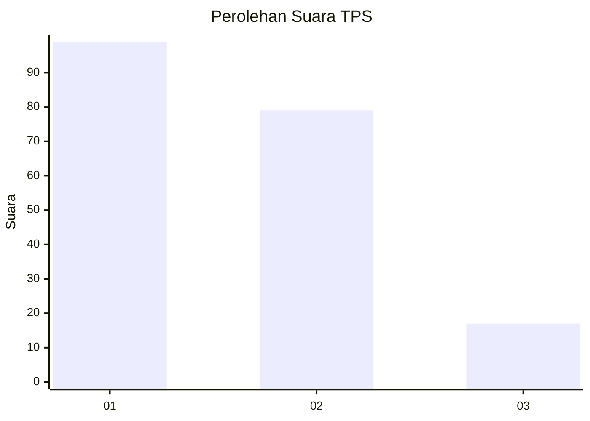
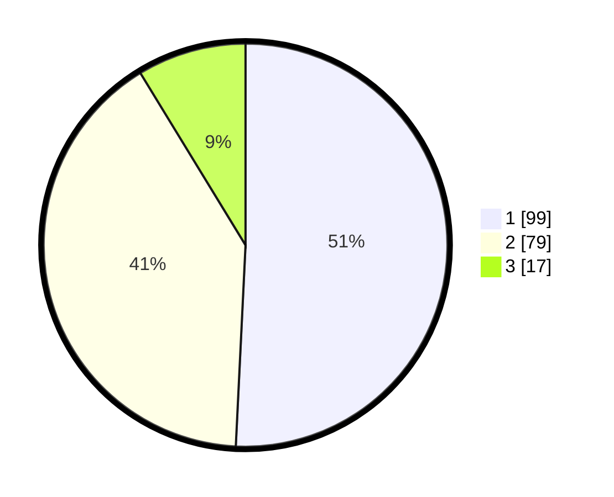

# Hasil

## Grafik

## Tabel

| No. | Nama Paslon    | Suara | Suara (raw) | Persentase |
|:--- |:-------------- | -----:| -----------:| ----------:|
| 1   | ANIES MUHAIMIN | 99    | [99][p-1]   | 50,77      |
| 2   | PRABOWO GIBRAN | 79    | [79][p-2]   | 40,51      |
| 3   | GANJAR MAHFUD  | 17    | [17][p-3]   | 8,72       |

[p-1]: https://github.com/gigit-pemilu/pemilu-2024-76-sulawesi-barat/blob/main/pilpres/hitung-suara/sub/76-sulawesi-barat/sub/04-polewali-mandar/sub/01-tinambung/sub/1001-tinambung/sub/004-tps/sub/paslon-1.txt
[p-2]: https://github.com/gigit-pemilu/pemilu-2024-76-sulawesi-barat/blob/main/pilpres/hitung-suara/sub/76-sulawesi-barat/sub/04-polewali-mandar/sub/01-tinambung/sub/1001-tinambung/sub/004-tps/sub/paslon-2.txt
[p-3]: https://github.com/gigit-pemilu/pemilu-2024-76-sulawesi-barat/blob/main/pilpres/hitung-suara/sub/76-sulawesi-barat/sub/04-polewali-mandar/sub/01-tinambung/sub/1001-tinambung/sub/004-tps/sub/paslon-3.txt

## Foto C Plano

https://sirekap-obj-formc.kpu.go.id/ee70/pemilu/ppwp/76/04/01/10/01/7604011001004-20240215-085240--6c09471c-f7aa-4ad6-8012-0748197f2cc8.jpg

https://sirekap-obj-formc.kpu.go.id/ee70/pemilu/ppwp/76/04/01/10/01/7604011001004-20240215-092802--444ba72f-82e7-4c60-900d-cd3e771e1393.jpg

https://sirekap-obj-formc.kpu.go.id/ee70/pemilu/ppwp/76/04/01/10/01/7604011001004-20240215-085551--10e3e506-bc27-4d31-9dae-19a241d5c8ea.jpg

## Metadata

| Key        | Value               |
| ---------- | ------------------- |
| Time Stamp | 2024-02-22 01:00:00 |

