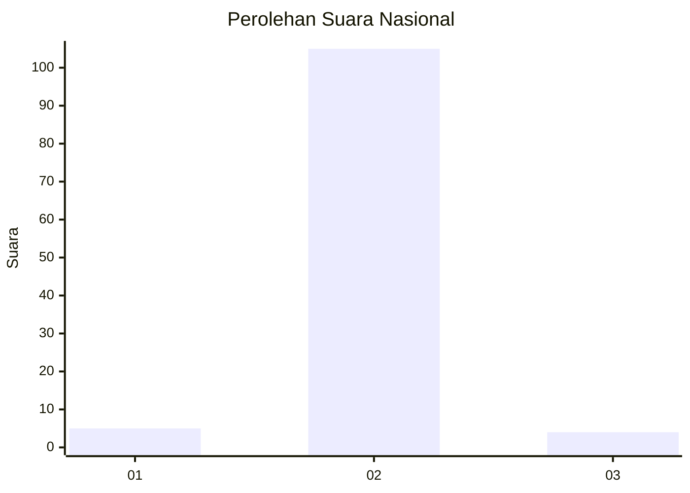
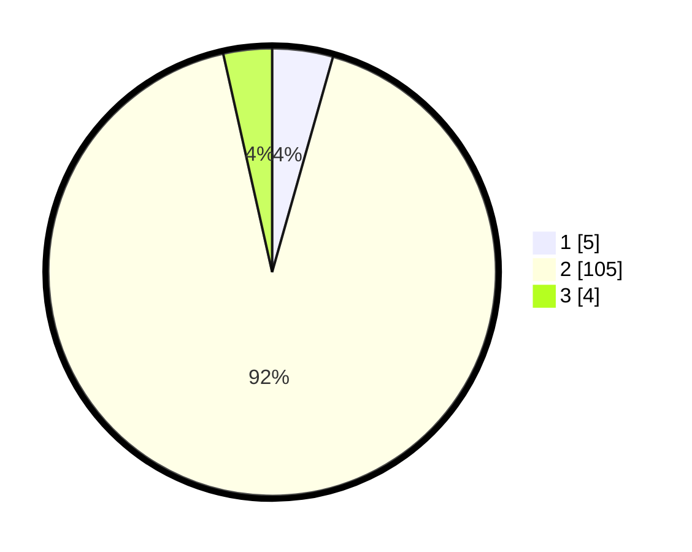

# Hasil

## Grafik

## Tabel

| No. | Nama Paslon    | Suara | Suara (raw) | Persentase |
|:--- |:-------------- | -----:| -----------:| ----------:|
| 1   | ANIES MUHAIMIN | 5     | [5][p-1]    | 4,39       |
| 2   | PRABOWO GIBRAN | 105   | [105][p-2]  | 92,11      |
| 3   | GANJAR MAHFUD  | 4     | [4][p-3]    | 3,51       |

[p-1]: https://github.com/gigit-pemilu/pemilu-2024/blob/main/pilpres/hitung-suara/sub/76-sulawesi-barat/sub/04-polewali-mandar/sub/10-luyo/sub/2002-tenggelang/sub/011-tps/sub/paslon-1.txt
[p-2]: https://github.com/gigit-pemilu/pemilu-2024/blob/main/pilpres/hitung-suara/sub/76-sulawesi-barat/sub/04-polewali-mandar/sub/10-luyo/sub/2002-tenggelang/sub/011-tps/sub/paslon-2.txt
[p-3]: https://github.com/gigit-pemilu/pemilu-2024/blob/main/pilpres/hitung-suara/sub/76-sulawesi-barat/sub/04-polewali-mandar/sub/10-luyo/sub/2002-tenggelang/sub/011-tps/sub/paslon-3.txt

## Foto C Plano

https://sirekap-obj-formc.kpu.go.id/742a/pemilu/ppwp/76/04/10/20/02/7604102002011-20240220-133236--3f740c04-4b0b-4677-9093-16c8262ba28f.jpg

https://sirekap-obj-formc.kpu.go.id/742a/pemilu/ppwp/76/04/10/20/02/7604102002011-20240220-133312--0e03edf3-f2de-4613-bca4-216de72d0e36.jpg

https://sirekap-obj-formc.kpu.go.id/742a/pemilu/ppwp/76/04/10/20/02/7604102002011-20240220-133355--0e266c8a-5b8a-46f0-87b8-40b71aa2f68e.jpg

## Metadata

| Key        | Value               |
| ---------- | ------------------- |
| Time Stamp | 2024-02-20 14:00:00 |

## DATA PEMILIH TETAP

Jumlah pemilih dalam DPT: **247**.
 * L: **136**.
 * P: **181**.

## DATA PENGGUNA HAK PILIH

Jumlah pengguna hak pilih dalam DPT: **214**.
 * L: **116**.
 * P: **299**.

Jumlah pengguna hak pilih dalam DPTb: **282**.
 * L: **808**.
 * P: **882**.

Jumlah pengguna hak pilih dalam DPK: **888**.
 * L: **888**.
 * P: **880**.

Jumlah pengguna hak pilih: **226**.
 * L: **156**.
 * P: **199**.

## JUMLAH SUARA SAH DAN TIDAK SAH

JUMLAH SELURUH SUARA SAH: **255**.

JUMLAH SUARA TIDAK SAH: **1**.

JUMLAH SELURUH SUARA SAH DAN SUARA TIDAK SAH: **216**.

