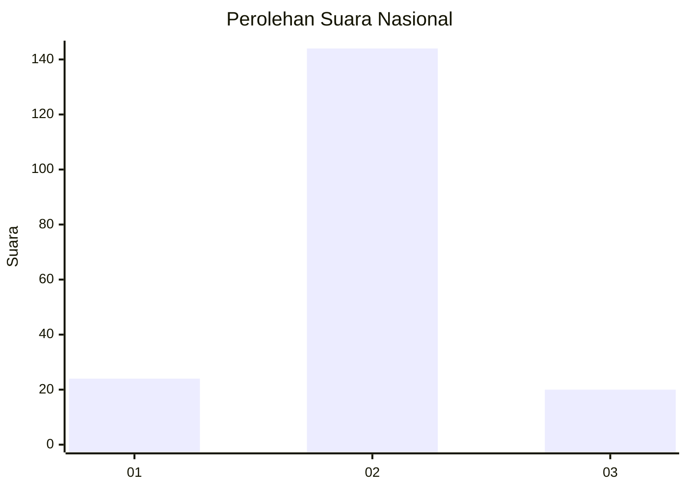
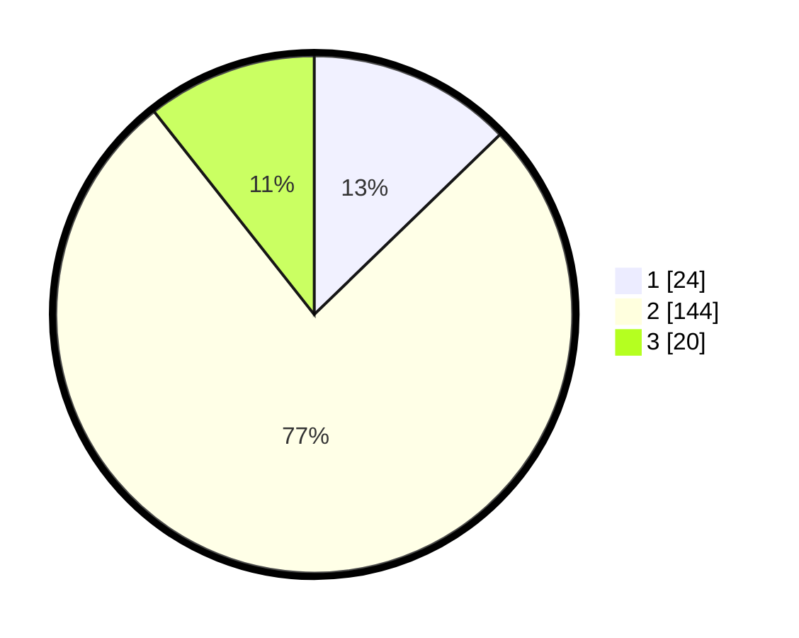

# Hasil

## Grafik

## Tabel

| No. | Nama Paslon    | Suara | Suara (raw) | Persentase |
|:--- |:-------------- | -----:| -----------:| ----------:|
| 1   | ANIES MUHAIMIN | 24    | [24][p-1]   | 12,77      |
| 2   | PRABOWO GIBRAN | 144   | [144][p-2]  | 76,60      |
| 3   | GANJAR MAHFUD  | 20    | [20][p-3]   | 10,64      |

[p-1]: https://github.com/gigit-pemilu/pemilu-2024/blob/main/pilpres/hitung-suara/sub/76-sulawesi-barat/sub/06-mamuju-tengah/sub/02-pangale/sub/2005-kuo/sub/002-tps/sub/paslon-1.txt
[p-2]: https://github.com/gigit-pemilu/pemilu-2024/blob/main/pilpres/hitung-suara/sub/76-sulawesi-barat/sub/06-mamuju-tengah/sub/02-pangale/sub/2005-kuo/sub/002-tps/sub/paslon-2.txt
[p-3]: https://github.com/gigit-pemilu/pemilu-2024/blob/main/pilpres/hitung-suara/sub/76-sulawesi-barat/sub/06-mamuju-tengah/sub/02-pangale/sub/2005-kuo/sub/002-tps/sub/paslon-3.txt

## Foto C Plano

https://sirekap-obj-formc.kpu.go.id/0b5f/pemilu/ppwp/76/06/02/20/05/7606022005002-20240225-182719--9cc66f36-3b81-41e8-8fa6-0d6356166dd8.jpg

https://sirekap-obj-formc.kpu.go.id/0b5f/pemilu/ppwp/76/06/02/20/05/7606022005002-20240225-183450--362b0d29-9878-41e2-96b3-bc0cc814540b.jpg

https://sirekap-obj-formc.kpu.go.id/0b5f/pemilu/ppwp/76/06/02/20/05/7606022005002-20240225-183449--1ce51232-b69d-4eff-96d0-b2107e30a30b.jpg

## Metadata

| Key        | Value               |
| ---------- | ------------------- |
| Time Stamp | 2024-02-25 19:00:00 |

## DATA PEMILIH TETAP

Jumlah pemilih dalam DPT: **522**.
 * L: **564**.
 * P: **474**.

## DATA PENGGUNA HAK PILIH

Jumlah pengguna hak pilih dalam DPT: **834**.
 * L: **495**.
 * P: **842**.

Jumlah pengguna hak pilih dalam DPTb: **835**.
 * L: **803**.
 * P: **83**.

Jumlah pengguna hak pilih dalam DPK: **888**.
 * L: **880**.
 * P: **888**.

Jumlah pengguna hak pilih: **884**.
 * L: **885**.
 * P: **294**.

## JUMLAH SUARA SAH DAN TIDAK SAH

JUMLAH SELURUH SUARA SAH: **188**.

JUMLAH SUARA TIDAK SAH: **1**.

JUMLAH SELURUH SUARA SAH DAN SUARA TIDAK SAH: **189**.

